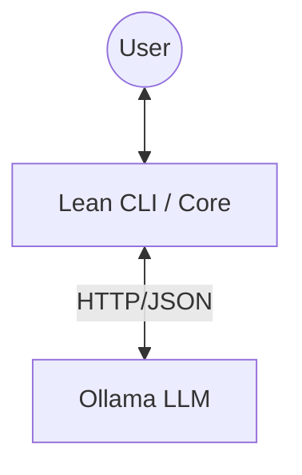

# Architecture: System Design

## Communication Model Decision
**Decision**: **Lean-only Stack**.

### Why Lean-only?
The user has requested to use Lean for the persistence/backend layer. Lean 4 is a fully capable functional programming language that can handle HTTP requests and state management.

1.  **Direct Communication**: The Lean application will communicate directly with the Ollama API.
2.  **Simplified Stack**: Removes the need for a separate Python process and the complexity of inter-process communication between Lean and Python.
3.  **Unified Language**: Logic and State are handled in the same language (Lean).

## Component Architecture

*   **Lean CLI / Core**:
    *   Handles User Input/Output (REPL).
    *   Maintains Conversation State (Memory).
    *   Constructs HTTP requests to Ollama.
    *   Parses JSON responses.

*   **Ollama**:
    *   Provides the LLM inference via local REST API (default `http://localhost:11434`).
