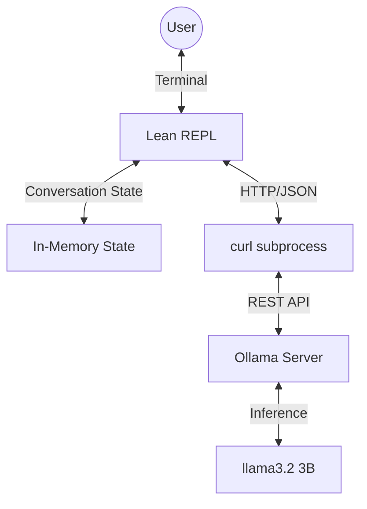

# Architecture: System Design

This document describes the system architecture across versions, focusing on component structure, data flow, and layer interactions.

---

## v0.1.0 Architecture (Current - Simple Conversation Partner)

### System Overview



### Components

#### 1. Lean Core (`core/`)
**Location**: `core/Main.lean`, `core/Klei/Ollama.lean`

**Responsibilities**:
- User interface (REPL loop)
- Conversation state management (in-memory)
- HTTP request construction
- JSON parsing of responses
- Error handling

**Implementation Details**:
- REPL: `partial def repl` in Main.lean
- HTTP: Uses `IO.Process.run` to spawn curl subprocess
- JSON: Lean's built-in `Json` module with `ToJson`/`FromJson` derivation
- State: Simple prompt/response pairs (no persistence)

**Key Functions**:
- `Klei.Ollama.generate : String → IO String`
  - Constructs JSON request
  - Spawns curl to POST to Ollama
  - Parses JSON response
  - Returns generated text

#### 2. Ollama
**Deployment**: External process (user-managed or via `start-ollama`)

**API**: REST API on `http://localhost:11434`
- Endpoint: `/api/generate`
- Method: POST
- Format: JSON

**Configuration**:
- Models stored in `.ollama/models`
- Environment variable: `OLLAMA_HOST` (default: `127.0.0.1:11434`)
- Started via Nix shell helper: `start-ollama`

#### 3. Communication Layer
**Method**: HTTP via curl subprocess

**Flow**:
1. Lean constructs JSON request
2. Spawns curl process with JSON as stdin
3. Waits for response
4. Parses JSON from stdout
5. Extracts text field

**Limitations**:
- High latency (~100-200μs subprocess overhead)
- No connection pooling
- Inefficient for rapid requests
- JSON parsing happens on every request

### Data Flow (v0.1.0)

```
User types message
  ↓
REPL receives input
  ↓
Construct JSON request
  ↓
Spawn curl subprocess
  ↓
curl sends HTTP POST to Ollama
  ↓
Ollama processes request (inference)
  ↓
Ollama returns JSON response
  ↓
curl writes to stdout
  ↓
Lean parses JSON
  ↓
Extract text field
  ↓
Display to user
  ↓
Wait for next input
```


---

## v0.2.0 Architecture (Planned - High-Performance Communication)

### System Overview

```mermaid
graph TD
    User((User)) <--> |Terminal| REPL[Lean REPL]
    REPL <--> |Backend Abstraction| Backend[Backend Interface]
    Backend <--> |Legacy| Ollama[Ollama Backend]
    Backend <--> |New| vLLM[vLLM Backend]

    vLLM <--> |Lean FFI| FFI[C Socket Shim]
    FFI <--> |Unix Domain Socket| UDS[/tmp/vllm.sock]
    UDS <--> |JSON-RPC| vLLMServer[vLLM Server]
    vLLMServer <--> |Inference| Model[20B Q4 Model]

    Ollama <--> |curl/HTTP| OllamaServer[Ollama Server]
    OllamaServer <--> |Inference| SmallModel[llama3.2 3B]
```

### Components

#### 1. Lean Core (Enhanced)
**New Modules**:
- `Klei/Communication/Socket.lean`: FFI bindings for UDS
- `Klei/Communication/Protocol.lean`: JSON-RPC over UDS
- `Klei/vLLM.lean`: vLLM client
- `Klei/Backend.lean`: Backend abstraction layer

**Updated Modules**:
- `Main.lean`: Support backend selection via environment variable

#### 2. C FFI Layer
**Location**: `core/FFI/`

**Purpose**: Wrapper around POSIX socket API for UDS operations (see `../3-specification/02-uds-communication.md` for details)

#### 3. Communication Stack

**Layer 1: C Shim** (`FFI/socket.c`)
- POSIX socket operations
- `AF_UNIX` domain sockets
- Blocking I/O with timeouts

**Layer 2: Lean FFI Bindings** (`Communication/Socket.lean`)
- `@[extern]` declarations for C functions
- Type-safe wrappers returning `Except SocketError α`
- Resource management with `withSocket`
- IO monad for effects

**Layer 3: Protocol** (`Communication/Protocol.lean`)
- JSON-RPC 2.0 over UDS
- Request/response correlation
- Newline-delimited JSON
- Error handling and parsing

**Layer 4: vLLM Client** (`vLLM.lean`)
- OpenAI-compatible API
- `/v1/completions` endpoint
- Parameter handling (max_tokens, temperature, etc.)
- Response extraction

#### 4. Backend Abstraction
**Purpose**: Support both Ollama and vLLM backends

**Selection**: Environment variable `KLEI_BACKEND` switches between implementations

#### 5. vLLM Server
**Deployment**: External process with UDS listener
**API**: OpenAI-compatible (`/v1/completions`, `/v1/chat/completions`)

### Data Flow (v0.2.0 with vLLM)

```
User types message
  ↓
REPL receives input
  ↓
Backend.generate called
  ↓
vLLM backend selected
  ↓
Construct JSON-RPC request
  ↓
Call Socket.send (Lean FFI)
  ↓
C shim: send() syscall
  ↓
UDS: /tmp/vllm.sock
  ↓
vLLM receives request
  ↓
vLLM processes (inference with PagedAttention)
  ↓
vLLM sends JSON response via UDS
  ↓
C shim: recv() syscall
  ↓
Lean FFI: parse ByteArray
  ↓
Protocol layer: parse JSON-RPC
  ↓
vLLM client: extract completion text
  ↓
Return to REPL
  ↓
Display to user
```


### Performance Characteristics

| Metric | v0.1.0 (HTTP/curl) | v0.2.0 (UDS) | Improvement |
|--------|-------------------|--------------|-------------|
| Communication latency | ~100-200μs | <50μs | 2-4x faster |
| Model size | 3B params | 20B params | 6-7x larger |
| Context window | ~8k tokens | 32k+ tokens | 4x larger |
| VRAM usage | ~2 GB | ~15 GB | Optimized for target |
| Connection overhead | High (subprocess) | Low (persistent) | Eliminated |


---

## v0.3.0+ Architecture (Future)

**v0.3.0**: Adds verified state machine and type-safe tool system
**v0.4.0+**: MCP integration, web search, persistent storage

(Details deferred to future planning documents)

---

## Architectural Layers

All versions follow a layered architecture:

1. **User Interface**: REPL
2. **Orchestration**: Backend abstraction, state management (v0.3.0+)
3. **Communication**: Protocol layer, FFI (v0.2.0+)
4. **System**: C shim, OS sockets (v0.2.0+)

---

## Key Design Trade-offs

| Decision | v0.1.0 | v0.2.0+ | Rationale |
|----------|--------|---------|-----------|
| **Language** | Lean 4 | Lean 4 + C FFI | Type safety, verification, single stack |
| **Inference** | Ollama | vLLM | PagedAttention, larger models, production-grade |
| **Communication** | HTTP/curl | UDS | 2-4x lower latency, security, simplicity |
| **Architecture** | Monolithic | Layered | Separation of concerns, testability |

---

## References

- vLLM Documentation: https://docs.vllm.ai/
- Lean 4 Manual: https://lean-lang.org/lean4/doc/
- Unix Domain Sockets: POSIX.1-2008 specification
- OpenAI API: https://platform.openai.com/docs/api-reference
- Related Planning Documents:
  - `../0-ideation/02-vllm-orchestrator-vision.md`: Technical vision
  - `../1-requirements/02-v0.2.0-vllm-communication.md`: v0.2.0 requirements
  - `../3-specification/02-uds-communication.md`: UDS specification
  - `../4-implementation/01-v0.2.0-plan.md`: Implementation plan
