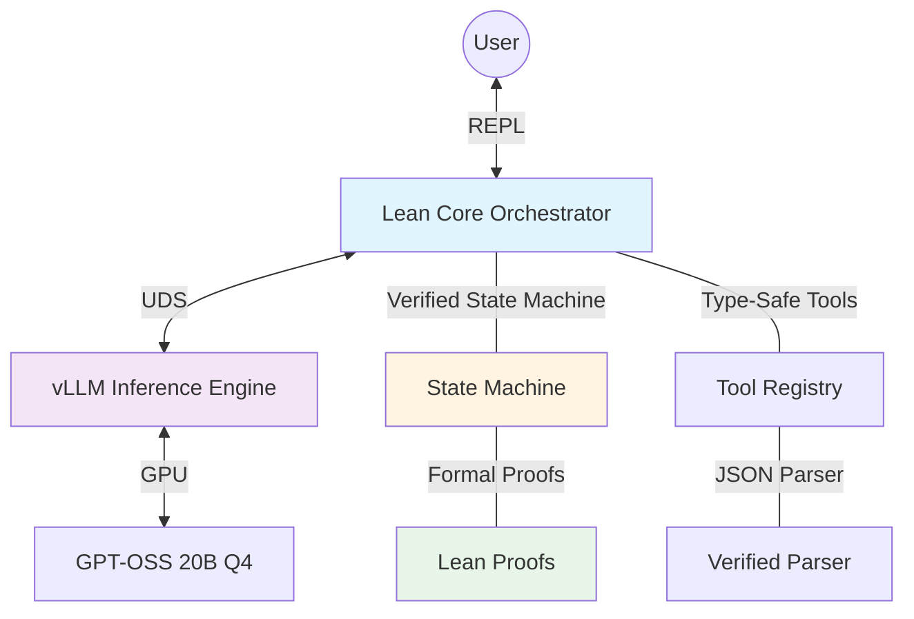

# Architecture: v0.2.0 - High-Performance Verified Orchestrator

## Overview

Version 0.2.0 introduces significant architectural changes to support advanced reasoning, formal verification, and high-performance operation within a 16 GB VRAM constraint.

## System Architecture



## Component Architecture

### 1. Lean Core Orchestrator

**Location:** `core/`

The Lean core is the heart of the system, responsible for:
- REPL interface and user interaction
- State machine execution with formal verification
- Communication with vLLM via Unix Domain Sockets
- Tool orchestration and execution
- Context management and conversation history

**Key Modules:**

```
core/
├── Klei.lean              # Library root
├── Main.lean              # Entry point and REPL
├── Klei/
│   ├── Orchestrator.lean  # Main orchestration logic
│   ├── StateMachine.lean  # Verified state machine
│   ├── Communication/
│   │   ├── Socket.lean    # UDS FFI bindings
│   │   └── Protocol.lean  # Message protocol
│   ├── Tools/
│   │   ├── Registry.lean  # Tool definitions
│   │   ├── Schema.lean    # Tool schemas (inductive types)
│   │   └── Executor.lean  # Tool execution engine
│   ├── Parser/
│   │   ├── JSON.lean      # Verified JSON parser
│   │   └── ToolCall.lean  # Tool call parser
│   └── vLLM.lean          # vLLM client (replaces Ollama.lean)
└── FFI/
    └── socket.c           # C shim for socket operations
```

### 2. vLLM Inference Engine

**Deployment:** External process, managed by Nix shell

vLLM replaces Ollama as the inference engine, providing:
- PagedAttention for efficient KV cache management
- Native MCP support for tool calling
- OpenAI-compatible API
- Unix Domain Socket listener

**Configuration:**
```bash
vllm serve MODEL_NAME \
  --quantization awq \          # Q4 quantization
  --dtype half \                # FP16 weights
  --max-model-len 32768 \       # 32k context
  --gpu-memory-utilization 0.90 \
  --kv-cache-dtype auto \
  --enable-prefix-caching \
  --uvicorn-unix-socket /tmp/vllm.sock
```

**Memory Budget (16 GB VRAM):**
- Model weights (Q4): ~11 GB
- KV cache (32k ctx): ~3-4 GB
- Overhead: ~1-2 GB

### 3. Communication Layer: Unix Domain Sockets

**Why UDS over HTTP?**

| Aspect | HTTP/TCP | Unix Domain Sockets |
|--------|----------|---------------------|
| Security | Network exposed | Filesystem permissions |
| Latency | ~100-200μs | ~10-50μs |
| Throughput | Limited by TCP | Higher bandwidth |
| Setup | Port management, firewall | Simple file path |
| Overhead | TLS/HTTP parsing | Minimal |

**Implementation Stack:**

1. **C Shim** (`core/FFI/socket.c`):
   - Wraps standard `socket.h` functions
   - Handles `AF_UNIX` socket creation and communication
   - Provides simple C API for Lean FFI

2. **Lean FFI Bindings** (`core/Klei/Communication/Socket.lean`):
   - `extern` declarations for C functions
   - Type-safe wrapper around raw C calls
   - IO monad for effectful operations

3. **Protocol Layer** (`core/Klei/Communication/Protocol.lean`):
   - JSON-RPC over UDS
   - Request/response handling
   - Connection pooling and lifecycle management

**Example Flow:**
```
User Input → Lean Orchestrator
          → JSON Request (tool call schema)
          → UDS Write to /tmp/vllm.sock
          → vLLM processes request
          → JSON Response via UDS
          → Verified Parser → Lean Types
          → State Machine Transition
          → Execute Tool (if needed)
          → Response to User
```

### 4. Formal Verification Layer

**Location:** `proofs/` and inline in `core/`

The verification layer ensures correctness at compile time.

#### State Machine Verification

**Approach: Inductive State Machine with Proven Transitions**

```lean
-- Simplified example (actual implementation will be more complex)
inductive AgentState where
  | Idle : AgentState
  | Processing : String → AgentState
  | AwaitingTool : ToolCall → AgentState
  | ExecutingTool : ToolCall → AgentState
  | Complete : String → AgentState
  | Error : String → AgentState

inductive Transition where
  | userInput : String → Transition
  | llmResponse : String → Transition
  | toolCall : ToolCall → Transition
  | toolResult : ToolResult → Transition
  | error : String → Transition

-- Verified state transition function
def step : AgentState → Transition → AgentState
  | .Idle, .userInput prompt => .Processing prompt
  | .Processing _, .llmResponse resp => parseAndDecide resp
  | .AwaitingTool tc, .toolResult res => .Processing (formatResult res)
  | state, .error msg => .Error msg
  | _, _ => .Error "Invalid transition"

-- Proof: step always produces a valid state
theorem step_valid : ∀ s t, ValidState (step s t) := by
  sorry -- Proof implementation
```

**Alternative: Kleisli Category**

For composable, effectful computations:
```lean
-- Tool calls as monadic actions
def ToolAction (α : Type) := StateT AgentState (ExceptT Error IO) α

-- Compose tool actions with verification
def composeTool : ToolAction α → ToolAction β → ToolAction β
  -- Composition preserves invariants
```

#### Tool Call Verification

**Type-Safe Tool Definitions:**

```lean
-- Tool schema as inductive type
inductive ToolSchema where
  | search : String → ToolSchema
  | calculate : Float → Float → (Float → Float → Float) → ToolSchema
  | fileRead : FilePath → ToolSchema

-- Parser from JSON to verified schema
def parseToolCall (json : JSON) : Except Error ToolSchema :=
  match json.getField "name" with
  | "search" =>
      json.getField "args" >>= fun args =>
      args.getString "query" >>= fun q =>
      pure (.search q)
  | "calculate" =>
      -- Parse and validate parameters
      parseCalculateArgs json
  | _ => .error "Unknown tool"

-- Theorem: parseToolCall only produces valid tools
theorem parseToolCall_valid :
  ∀ json, (parseToolCall json).isOk → ValidTool (parseToolCall json).get!
```

### 5. Tool System

**Registry Pattern:**

```lean
structure ToolDef where
  name : String
  schema : ToolSchema
  description : String
  execute : ToolSchema → IO ToolResult
  -- Precondition that must hold
  requires : ToolSchema → Prop
  -- Postcondition guaranteed after execution
  ensures : ToolSchema → ToolResult → Prop

-- Global tool registry
def toolRegistry : HashMap String ToolDef := ...

-- Verified tool lookup
def getTool (name : String) : Option ToolDef :=
  toolRegistry.find? name
```

**Tool Execution Pipeline:**

1. LLM returns JSON with tool call
2. Verified parser maps JSON → ToolSchema
3. Type checker validates schema
4. State machine transitions to ExecutingTool
5. Tool executor runs with I/O effects
6. Result integrated back into context
7. State machine transitions based on result

### 6. Context Management

**KV Cache Strategy:**

- **Prefix Caching**: vLLM caches common prefixes (system prompts)
- **Sliding Window**: Keep recent N tokens in full resolution
- **Summarization**: Compress older context (future)

**Memory Tracking:**

```lean
structure ContextWindow where
  systemPrompt : String
  conversationHistory : List Message
  toolResults : List ToolResult
  maxTokens : Nat := 32768

def estimateTokens (ctx : ContextWindow) : Nat := ...

def pruneContext (ctx : ContextWindow) : ContextWindow :=
  if estimateTokens ctx > ctx.maxTokens then
    { ctx with conversationHistory := dropOldest ctx.conversationHistory }
  else
    ctx
```

## Data Flow

### Request Flow

```
1. User types message in REPL
2. Lean core constructs prompt with context
3. Send JSON-RPC request via UDS to vLLM
4. vLLM generates response (streaming or complete)
5. Response arrives via UDS
6. Verified parser converts JSON → Lean types
7. State machine evaluates next action:
   - If text response: display to user
   - If tool call: parse, validate, execute tool
   - If error: handle gracefully
8. Update conversation context
9. Return to REPL
```

### Tool Call Flow

```
1. LLM response indicates tool call
2. JSON parser extracts tool specification
3. Verify tool exists in registry
4. Validate parameters against schema (compile-time)
5. State transition: Processing → AwaitingTool → ExecutingTool
6. Execute tool in IO monad
7. Capture result (success or error)
8. Format result for LLM context
9. Make follow-up request to LLM with tool result
10. State transition: ExecutingTool → Processing
11. Continue conversation
```

## Migration Strategy

### Phase 1: Foundation (Parallel Implementation)
- Implement UDS communication alongside existing HTTP
- Add vLLM backend while keeping Ollama
- Feature flag to switch between backends

### Phase 2: Verification (Gradual Typing)
- Add inductive types for tool schemas
- Implement verified parser for subset of tools
- Prove correctness of state transitions
- Expand coverage incrementally

### Phase 3: Integration (Testing)
- End-to-end tests with vLLM
- Performance benchmarking
- VRAM usage profiling
- Latency measurements

### Phase 4: Cutover (Default Switch)
- Switch default backend to vLLM
- Keep Ollama as fallback for debugging
- Update documentation

### Phase 5: Cleanup (Future)
- Remove Ollama code
- Eliminate HTTP/curl dependencies
- Full verification coverage

## Performance Targets

| Metric | Target | Measured By |
|--------|--------|-------------|
| First token latency (cold) | < 2s | Time to first response |
| First token latency (warm) | < 500ms | Cached context |
| Tool call overhead | < 100ms | Parse + validate time |
| VRAM usage (peak) | < 15.5 GB | nvidia-smi |
| Context window | 32k tokens | Successful generation |
| UDS latency | < 50μs | Round-trip time |

## Security Considerations

1. **Socket Permissions**: `/tmp/vllm.sock` with 0600 (owner-only)
2. **Input Validation**: All user inputs validated before LLM
3. **Tool Sandboxing**: Tools run with limited permissions (future)
4. **Resource Limits**: Timeout and memory bounds on tool execution
5. **Audit Logging**: All tool executions logged

## Open Questions

1. Should we use Kleisli Category or inductive state machine for verification?
2. What's the optimal strategy for context pruning at 32k limit?
3. Should tool execution be synchronous or asynchronous?
4. How to handle streaming responses from vLLM?
5. What's the fallback strategy if vLLM crashes?
